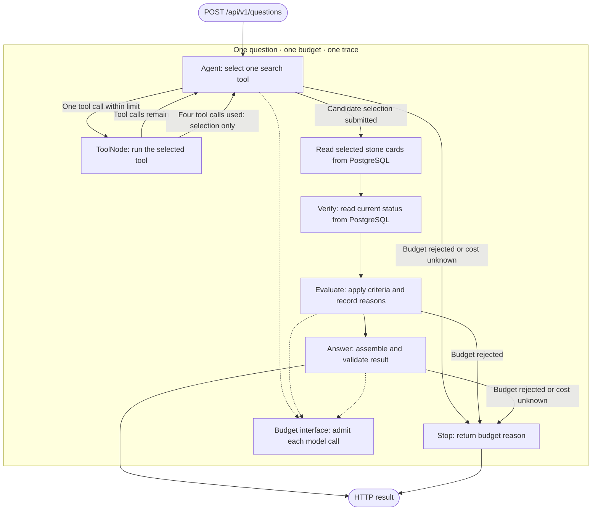

```mermaid
flowchart TD
    request([POST /api/v1/questions]) --> agent

    subgraph run[One question · one budget · one trace]
        agent[Agent: select one search tool]
        tools[ToolNode: run the selected tool]
        cards[Read selected stone cards from PostgreSQL]
        verify[Verify: read current status from PostgreSQL]
        evaluate[Evaluate: apply criteria and record reasons]
        answer[Answer: assemble and validate result]
        stop[Stop: return budget reason]
        budget[Budget interface: admit each model call]

        agent -->|One tool call within limit| tools
        agent -->|Candidate selection submitted| cards
        tools -->|Tool calls remain| agent
        tools -->|Four tool calls used: selection only| agent
        cards --> verify
        verify --> evaluate
        evaluate --> answer
        agent -->|Budget rejected or cost unknown| stop
        evaluate -->|Budget rejected| stop
        answer -->|Budget rejected or cost unknown| stop
        agent -.-> budget
        evaluate -.-> budget
        answer -.-> budget
    end

    answer --> response([HTTP result])
    stop --> response
```
