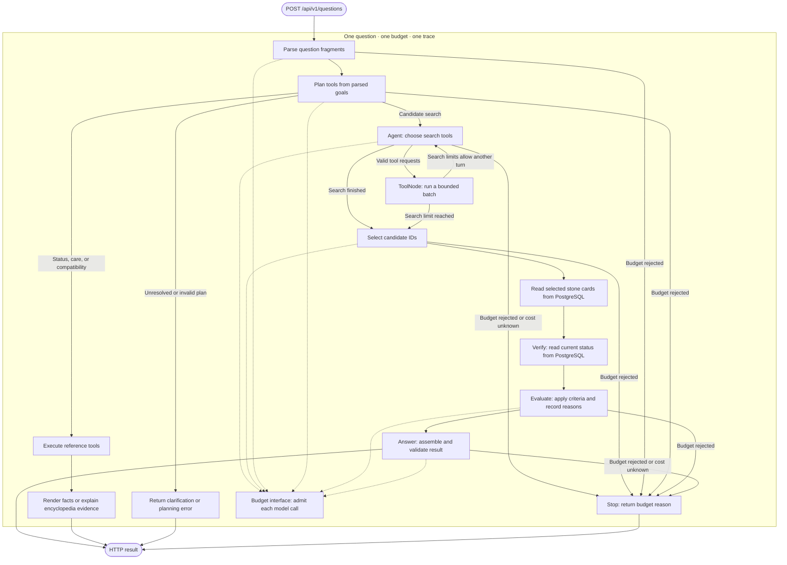

```mermaid
flowchart TD
    request([POST /api/v1/questions]) --> parse

    subgraph run[One question · one budget · one trace]
        agent[Agent: choose search tools]
        tools[ToolNode: run a bounded batch]
        select[Select candidate IDs]
        parse[Parse question fragments]
        plan[Plan tools from parsed goals]
        facts[Execute reference tools]
        facts_answer[Render facts or explain encyclopedia evidence]
        clarify[Return clarification or planning error]
        cards[Read selected stone cards from PostgreSQL]
        verify[Verify: read current status from PostgreSQL]
        evaluate[Evaluate: apply criteria and record reasons]
        answer[Answer: assemble and validate result]
        stop[Stop: return budget reason]
        budget[Budget interface: admit each model call]

        agent -->|Valid tool requests| tools
        agent -->|Search finished| select
        tools -->|Search limits allow another turn| agent
        tools -->|Search limit reached| select
        parse --> plan
        plan -->|Candidate search| agent
        plan -->|Status, care, or compatibility| facts
        plan -->|Unresolved or invalid plan| clarify
        facts --> facts_answer
        select --> cards
        cards --> verify
        verify --> evaluate
        evaluate --> answer
        agent -->|Budget rejected or cost unknown| stop
        select -->|Budget rejected| stop
        parse -->|Budget rejected| stop
        plan -->|Budget rejected| stop
        evaluate -->|Budget rejected| stop
        answer -->|Budget rejected or cost unknown| stop
        agent -.-> budget
        select -.-> budget
        parse -.-> budget
        plan -.-> budget
        evaluate -.-> budget
        answer -.-> budget
    end

    answer --> response([HTTP result])
    facts_answer --> response
    clarify --> response
    stop --> response
```
